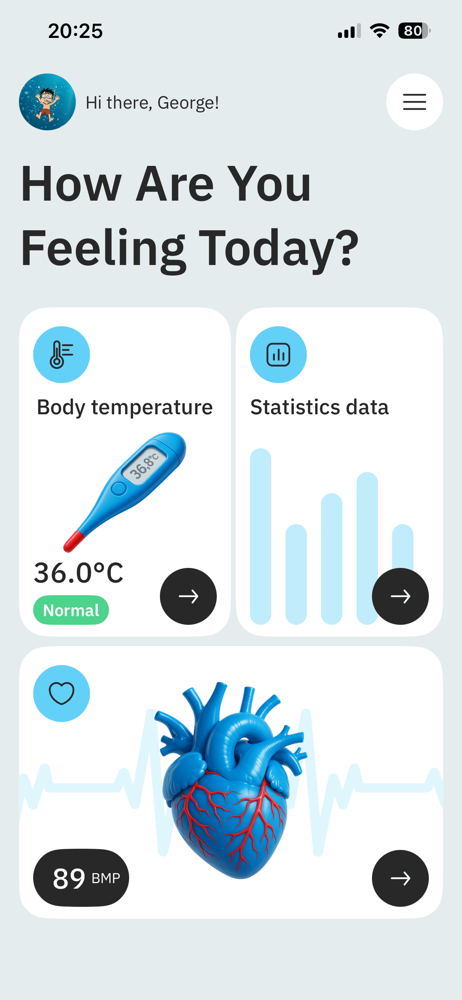
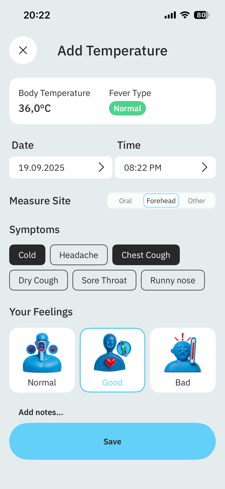
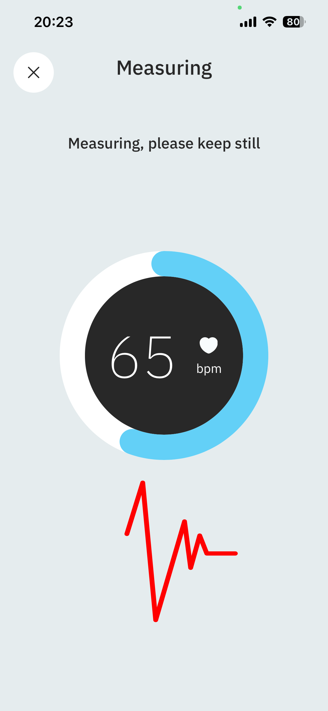
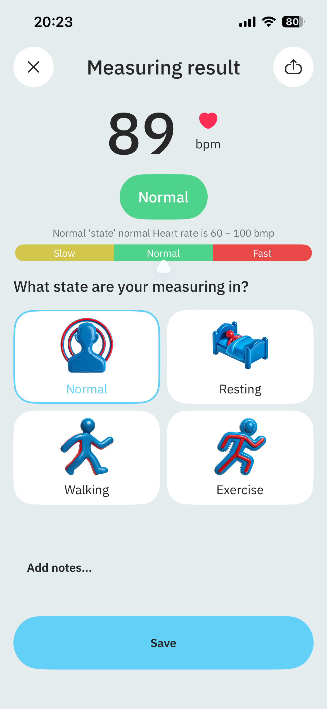
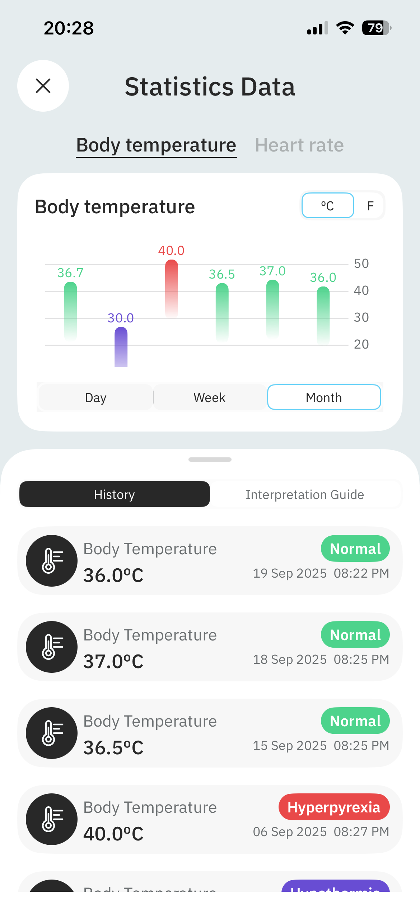
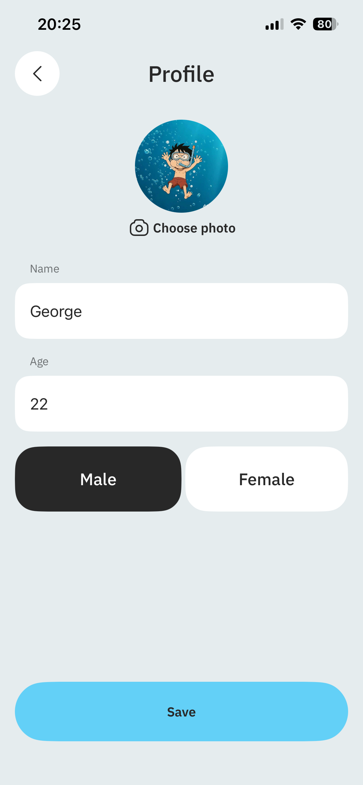

# BodyThermometerProject

**BodyThermometerProject** is an iOS application that helps users record and analyze their health state.  
The app allows you to log body temperature (with a note of how you feel), measure pulse (BPM) using the camera and flash, and save all results.  

All collected data is displayed in **statistics** with charts, where users can explore their condition over a **day, week, and month**.  

---

## Features
- Record body temperature with notes on how you feel  
- Measure pulse (BPM) with camera & flash  
- Save all data for future reference  
- View detailed statistics and charts  
- Explore health trends by day, week, and month  
- Profile management  
- Smooth UI with **Lottie animations**  

---

## Requirements
- iOS 16.0+  
- Xcode 15+  
- Swift 5.9+  

---

## 🏗️ Architecture
- **MVVM** → separates UI and business logic  
- **Router** → manages navigation between screens  
- **Assembler** → handles dependency injection  
- **RxSwift** → reactive streams for UI and data binding  
- **Realm** → persistent storage for measurements  
- **DGCharts** → visual statistics (day/week/month graphs)  
- **Apphud** → subscription management, paywalls
  
---

## Screenshots
 <p float="left">
  
  
  
</p>

<p float="left">
  
  
  
</p>


---

## Installation
1. Clone the repository: git clone https://github.com/EgorPetkevich/BodyTermometr.git

---
##  Dependencies (CocoaPods)
```ruby
pod 'RxSwift', '6.9.0'
pod 'RxCocoa', '6.9.0'
pod 'SnapKit', '~> 5.7.0'
pod 'RealmSwift', '10.42.0'
pod 'RxRealm', '~> 5.0'
pod 'DGCharts'
pod 'lottie-ios'
pod 'ApphudSDK', '~> 3.6'
